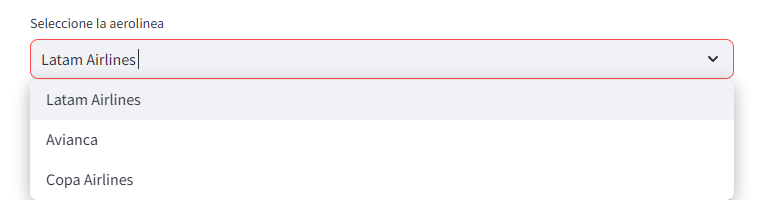
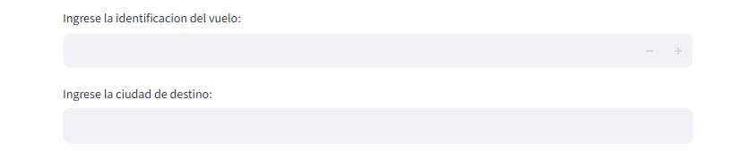
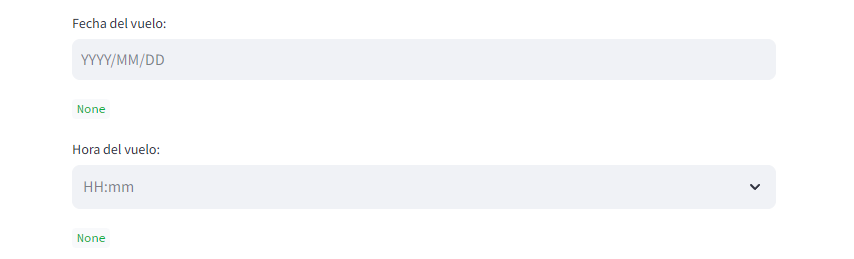

# README

Bienvenido al manual de asistencia al usuario del Aeropuerto Alfonso Bonilla Aragón

## Creación de vuelos

El usuario deberá elegir la opción que desee y se mostrara una imagen del nombre de la aerolinea.

El usuario deberá escribir con numeros la identificación. La ciudad de destino recibe letras.

El usuario deberá elegir la fecha del vuelo, el cuadro de texto verde mostrará la fecha seleccionada. La hora puede ingresarse según el usuario desee, digintandola o seleccionandola.

Una vez finalice, el usuario deberá usar el botón `Crear Vuelo` para confirmar los datos.

En caso de que no ingrese todos los datos aparecerá la siguiente imagen
