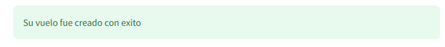

# README

Bienvenido al manual de asistencia al usuario del Aeropuerto Alfonso Bonilla Aragón

## Creación de vuelos

El usuario deberá elegir la opción que desee y se mostrara una imagen del nombre de la aerolinea.

El usuario deberá escribir con numeros la identificación. La ciudad de destino recibe letras.

El usuario deberá elegir la fecha del vuelo, el cuadro de texto verde mostrará la fecha seleccionada. La hora puede ingresarse según el usuario desee, digintandola o seleccionandola.

Una vez finalice, el usuario deberá usar el botón `Crear Vuelo` para confirmar los datos.

En caso de que no ingrese todos los datos aparecerá la siguiente imagen

En caso de exito aparecerá el siguiente mensaje en color verde:

## Creación de Aeronaves

1. Se encuentra un desplegable con la opción de elegir qué Aeronave se desea crear,las opciones son: `Avion`, `Jet Privado`, `Helicoptero`.
2. 1. Se encuentra un desplegable con la opción de elegir qué marca tendrá la aeronave. 
   2. En caso de `Avion`: `Boeing`, `Airbus`
   3. En caso de `Jet Privado`: `Boeing Business Jets`, `Airbus Corporate Jets`, `Sukhoi Superjet`, `Embraer Executive Jets`, `Bombardier`
   4. En caso de `Helicoptero`: `Airbus Helicopters`, `Bell`
3. 1. Se encuentra un desplegable para elegir la línea de la Aeronave (Unicamente disponible en `Avion` y `Helicoptero`)
   2. En caso de `Avion` con la marca `Boeing`: `Boeing 737`, `Boeing 747`, `Boeing 777`, `Boeing 787`
   3. En caso `Avion` con la marca `Airbus`: `Airbus A320`, `Airbus A330`, `Airbus A350`, `Airbus A380`, `Beluga Airbus`
   4. En caso de `Helicoptero` con la marca `Airbus Helicopters`: `Airbus H175M`, `Airbus ACH160`
   5. En caso de `Helicoptero` con la marca `Bell`: `Bell 427`, `Bell 429`
4. Se requiere que el usuario ingrese la capacidad del avion (numero)
 