## Creación de vuelos
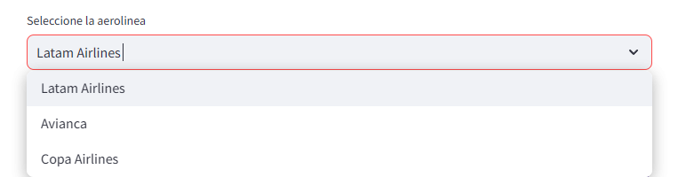

El usuario deberá elegir la opción que desee y se mostrara una imagen del nombre de la aerolinea.

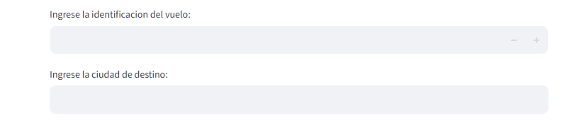

El usuario deberá escribir con numeros la identificación. La ciudad de destino recibe letras.

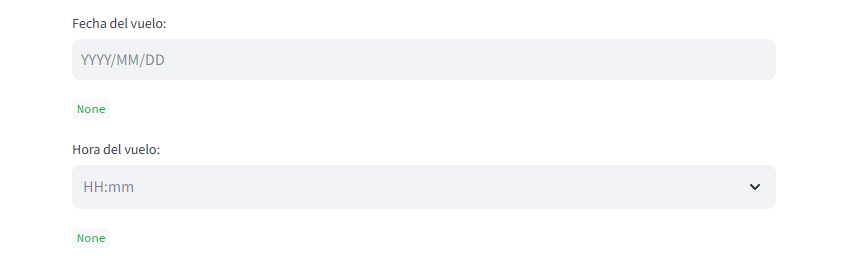

El usuario deberá elegir la fecha del vuelo, el cuadro de texto verde mostrará la fecha seleccionada. La hora puede ingresarse según el usuario desee, digintandola o seleccionandola.

Una vez finalice, el usuario deberá usar el botón `Crear Vuelo` para confirmar los datos.

En caso de que no ingrese todos los datos aparecerá la siguiente imagen:

En caso de exito aparecerá el siguiente mensaje en color verde:

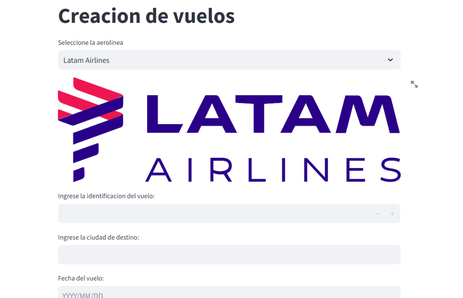

## Creación de Aeronaves

1. Se encuentra un desplegable con la opción de elegir qué Aeronave se desea crear,las opciones son: `Avion`, `Jet Privado`, `Helicoptero`.
2. 1. Se encuentra un desplegable con la opción de elegir qué marca tendrá la aeronave. 
   2. En caso de `Avion`: `Boeing`, `Airbus`.
   3. En caso de `Jet Privado`: `Boeing Business Jets`, `Airbus Corporate Jets`, `Sukhoi Superjet`, `Embraer Executive Jets`, `Bombardier`.
   4. En caso de `Helicoptero`: `Airbus Helicopters`, `Bell`.
3. 1. Se encuentra un desplegable para elegir la línea de la Aeronave (Unicamente disponible en `Avion` y `Helicoptero`).
   2. En caso de `Avion` con la marca `Boeing`: `Boeing 737`, `Boeing 747`, `Boeing 777`, `Boeing 787`.
   3. En caso `Avion` con la marca `Airbus`: `Airbus A320`, `Airbus A330`, `Airbus A350`, `Airbus A380`, `Beluga Airbus`.
   4. En caso de `Helicoptero` con la marca `Airbus Helicopters`: `Airbus H175M`, `Airbus ACH160`.
   5. En caso de `Helicoptero` con la marca `Bell`: `Bell 427`, `Bell 429`.
4. Se requiere que el usuario ingrese la capacidad del avion (numero). Si desea usar la capacidad real del avion, no debe ingresar nada
5. 1. En caso de `Avion`: Boton de `Mostrar Configuración Avanzada`, el cual permite que el usuario vea las especificaciones de la aeronave
   2. En caso de `Jet`: El usuario deberá ingresar el nombre del propietario del jet
   3. En caso de `Helicopter`: Boton de `Mostrar Configuración Avanzada`, el cual permite que el usuario vea las especificaciones de la aeronave

Nota: Para cada uno de los aviones hay una imagen.
También está implementado el manejo de excepciones.

## Reservar Vuelo

Para reservar vuelo el usuario deberá llenar los datos del pasajero.

Después se mostrara la siguiente información:

 
El usuario deberá digitar el numero que aparece en la fila de la tabla para la cual quiere seleccionar el vuelo.
Una vez seleccione el numero debera clickear el boton de `Reservar Vuelo`

Una confirmación se mostrará:
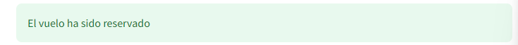

## Consultar Información

### Consultar Vuelos

En caso de haber vuelos se mostrará una tabla con todos los vuelos en el aeropuerto. La información incluye: `ID`, `Date`, `Departure Country`, `Destination`, `Time` y `Airline`

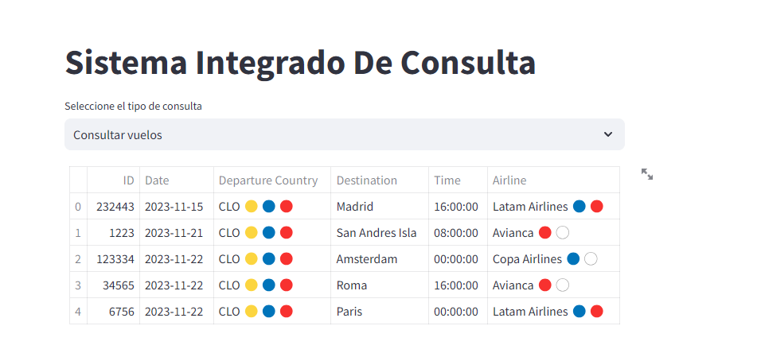

De lo contrario se muestra un mensaje advirtiendo que no hay vuelos.

### Consultar Puertas

Se mostrarán las puertas de Embarque

### Consultar Aeronaves

El usuario deberá seleccionar qué aeronave quiere consultar.

#### Caso de Avion
Se mostrará una tabla con todos los Aviones en el aeropuerto, la cual incluye:
`Brand`, `Capacity`, `Engine Count`, `Category`, `Autonomy`, `Available`

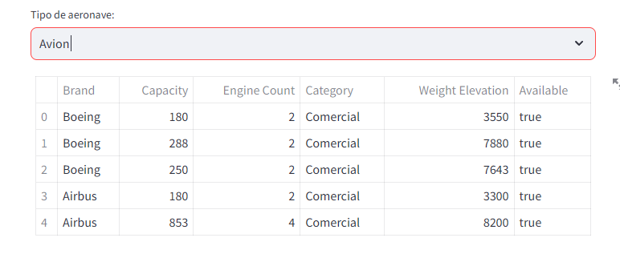

# Sistema para gestionar aeronaves. 
Se pide una contraseña. Esta contraseña es `nomelase`.
Una vez la contraseña se ingresa el usuario deberá usar la tecla `enter` para poder ver el menú que permite poner un avión en mantenimiento

En caso de que la contraseña sea incorrecta se mostrará un error:

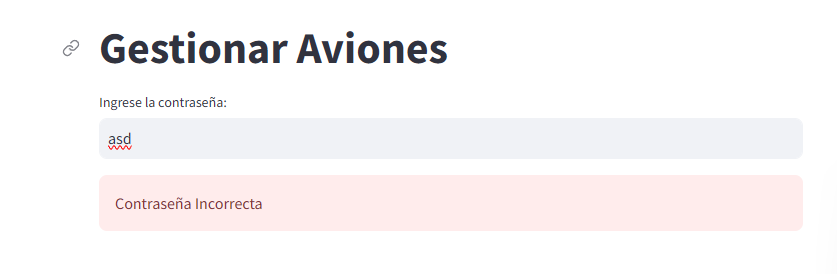

De lo contrario se muestra:

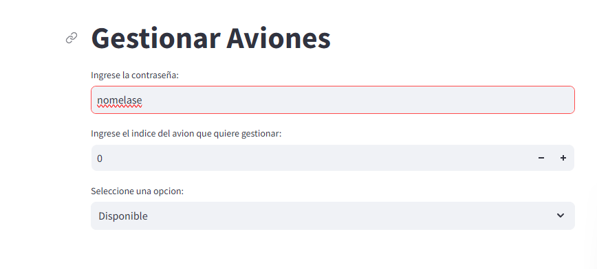

Posteriormente se encuentra un cuadro que pide el indice de la tabla para el avión que se desea gestionar.

Finalmente un desplegable que pide ingresar el nuevo estado al cual se pondrá el avión, se debe seleccionar dos veces la misma opcion, la primera para seleccionar, la segunda para confirmar. Las opciones son: `Disponible` el cual hará que el avión pase a true en un su atributo `Available` y en caso de usar la opción `Mantenimiento` el atributo del avión pasará a ser false indicando que no se puede utilizar el avión para la simulación.

## Simular

Esta opción permite hacer una simulación del aeropuerto en la cual se mostraran mensajes de las aeronaves comunicandose con la torre de control para avisar su estado. Se encuentra el siguiente menu:

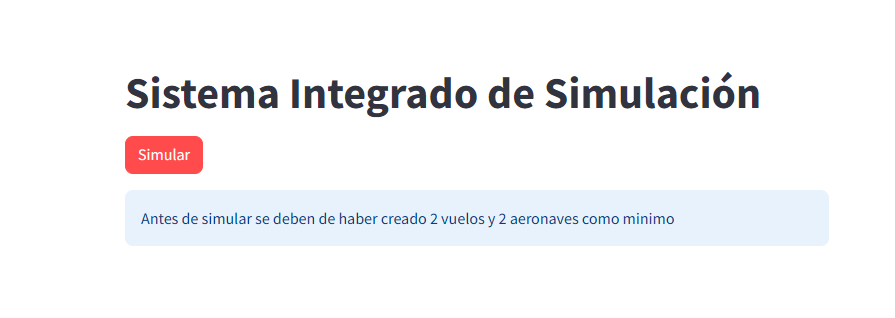

Hay una información que es muy importante para que la simulación funcione.

En caso de que el usuario decida ignorar esto hay dos warnings: 

1. Caso en el que no hay la cantidad de vuelos necesarios:
   
   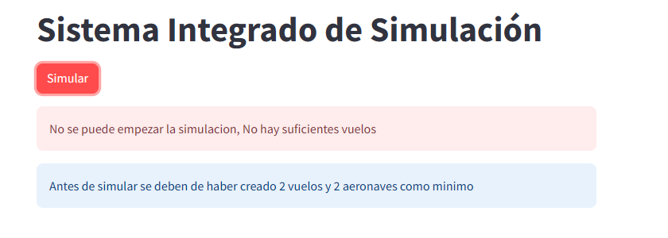

2. Caso en el que no hay la cantidad de Aeronaves necesarias:
   
   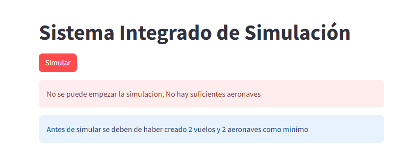

3. Si la simulación es exitosa, se mostraran los mensajes y saldrán globos de celebración en la pantalla:
   
   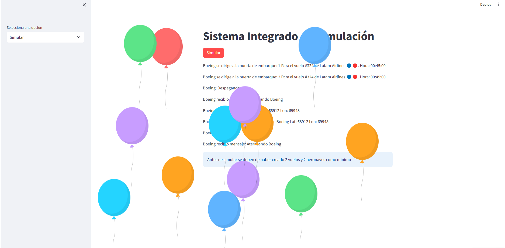

## API Consultar Pais

El menu es el siguiente:

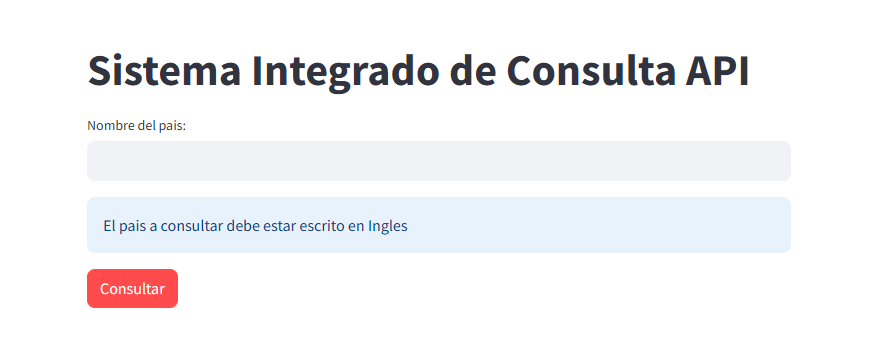

El usuario deberá escribir el nombre del país del cual desea saber: `Nombre`, `Capital`, `Continente`, `Población` y `Moneda Local`.

Usando a Colombia como ejemplo:

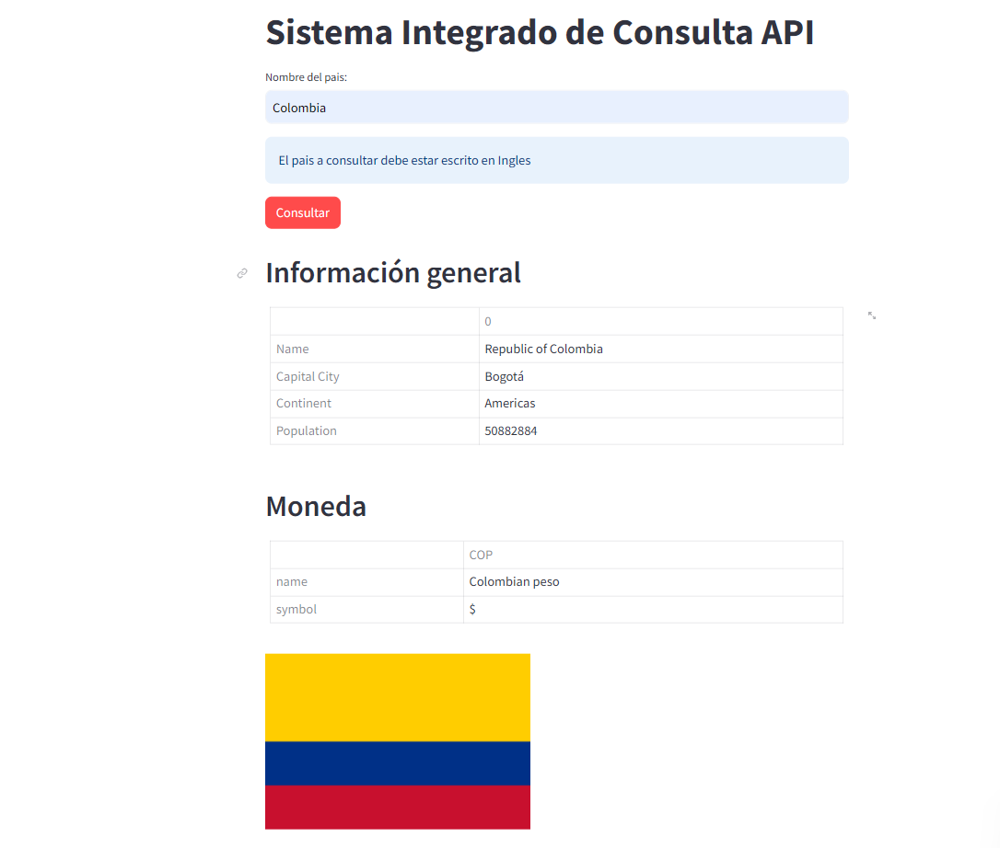

En caso de que no se encuentre el país:
- Asegurarse de que el nombre del país esté bien escrito.
- Asegurarse de que el país existe.
- Asegurarse que el nombre del país está escrito en Inglés, a pesar de que hay pais con los que funciona en español, en su gran mayoría funcionará mejor con los países escritos en Ingles.

Se mostrará una alerta:

